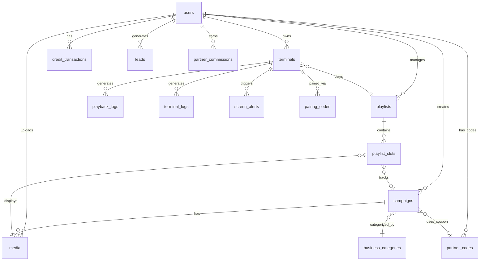

# 🧠 Rede Conecta Local — Estado Completo do Projeto

> **Última atualização**: 2026-02-07T17:40:00-03:00 | **Player**: V19.0.0 | **Supabase Project ID**: `tmohttbxrdpxtfjjlkkp`

---

## 1. Visão Geral

**Rede Conecta Local** é uma plataforma SaaS de **Digital Signage** (mídia indoor) que permite a donos de estabelecimentos comerciais exibirem propagandas em telas instaladas em seus comércios. O sistema é composto por três partes:

| Componente | Tecnologia | Deploy |
|------------|-----------|--------|
| **Admin Panel** | Vite + React + TailwindCSS | Vercel |
| **Player Windows** | Electron 35 + React + mpv | Mini PC com Windows |
| **Backend** | Supabase (Postgres + Auth + Storage + Realtime + Edge Functions) | Cloud |

### Modelo de Negócio
- **Parceiros** (donos de estabelecimentos) instalam telas + mini PCs
- **Clientes** (anunciantes) criam campanhas com mídias (vídeos/imagens)
- O sistema monta **playlists** com slots: `global` (admin), `partner` (parceiro), `local` (anunciantes) e `dynamic` (conteúdo dinâmico)
- Monetização via **créditos/tokens** — anunciantes compram créditos para veicular campanhas
- **Sistema de afiliados**: parceiros ganham comissões (referral 15% + revenue share 20%) via cupom de desconto

### Papéis de Usuário
| Role | Acesso |
|------|--------|
| `admin` | Total — gerencia tudo, aprova campanhas, gerencia parceiros |
| `parceiro` | Gerencia suas telas/terminais, vê relatórios, dashboard gamificado de ocupação |
| `cliente` | Cria campanhas, envia mídias, compra créditos |

---

## 2. Admin Panel (`admin-panel/`)

### Tech Stack
- **Framework**: Vite 7 + React 19
- **Routing**: react-router-dom 7
- **Styling**: TailwindCSS 3
- **Backend Client**: @supabase/supabase-js 2.93
- **Drag & Drop**: @dnd-kit (para reordenar slots de playlist)
- **Video Transcoding**: @ffmpeg/ffmpeg (transcode H.265→H.264 no browser)
- **Ícones**: lucide-react
- **Pagamento**: mercadopago SDK (preparado mas não integrado)

### Páginas (`src/pages/`)
| Arquivo | Função | Roles |
|---------|--------|-------|
| `Login.jsx` | Login + Cadastro (toggle) + Reset senha | Todos |
| `ResetPassword.jsx` | Tela de redefinição de senha | Todos |
| `Dashboard.jsx` | Dashboard com KPIs — diferente por role | Todos |
| `Campaigns/index.jsx` | Gestão completa de campanhas com moderação, AI simulator, checkout | admin/cliente |
| `Campaigns/CampaignModeration.jsx` | Aprovação/rejeição com alocação inteligente de slots | admin |
| `Campaigns/campaignUtils.js` | Propagação global/dinâmica + alocação sequencial de slots | admin |
| `MediaLibrary.jsx` | Upload e gestão de mídias (imgs + vídeos) com thumbnails | admin/cliente |
| `Playlists.jsx` | Criar/editar playlists com drag-and-drop de slots (13 slots tipados) | admin/parceiro |
| `Players.jsx` | Grid de cards de terminais — **cria playlist 1:1 automaticamente** ao criar terminal | admin/parceiro |
| `Player.jsx` | Detalhe de um terminal (logs, métricas, playlist) | admin/parceiro |
| `PartnerDashboard.jsx` | Dashboard gamificado do parceiro: barra de ocupação 10 slots, código de afiliado, extrato de comissões | parceiro |
| `Users.jsx` | CRUD de usuários (admin only) | admin |
| `Finance.jsx` | Transações financeiras e créditos | admin |
| `PlaybackReports.jsx` | Relatórios de Proof of Play por terminal/mídia | admin/parceiro |
| `Leads.jsx` | Gestão de leads para marketing | admin |
| `MyPlan.jsx` | Plano atual do cliente, uso de créditos | cliente |

### Componentes (`src/components/`)
| Arquivo | Função |
|---------|--------|
| `Layout.jsx` | Sidebar + header com nav baseada em role (parceiro vê apenas Dashboard e Finanças) |
| `CheckoutModal.jsx` | Modal de compra de créditos (Mercado Pago) |
| `GroupManagerModal.jsx` | Modal para gerenciar grupos de terminais |
| `ScreenAlertsPanel.jsx` | Painel de alertas de telas (offline, erro, etc.) |
| `ErrorBoundary.jsx` | Error boundary global |
| `AIAgentSimulator.jsx` | Simulador de IA para gerar campanhas (demo) |

### Hooks (`src/hooks/`)
| Arquivo | Função |
|---------|--------|
| `usePartnerData.js` | Carrega dados do parceiro: códigos de afiliado, comissões, terminal vinculado, slots ocupados |

### Arquivos Importantes
- `src/supabase.js` — Cliente Supabase configurado
- `src/db.js` — Helpers de banco (queries reutilizáveis)
- `src/utils/videoTranscoder.js` — Transcodificação de vídeo via ffmpeg.wasm
- `src/utils/planHelpers.js` — Helpers de plano (dias de validade por plano)
- `vite.config.js` — Configuração Vite com headers para SharedArrayBuffer (ffmpeg)

---

## 3. Arquitetura de Inventário (V19 — Grade de 12 Slots)

### Mapa da Grade (13 slots — loop de ~3 minutos)

| Slot | Tipo | Propagação | Duração | Descrição |
|------|------|-----------|----------|-----------|
| 0 | `global` | Em massa (toda rede) | 10s | Conteúdo institucional do admin |
| 1 | `partner` | Por terminal | 15s | Propaganda do parceiro dono da tela |
| 2-6 | `local` | Por terminal | 15s | **Slots de venda** — campanhas de anunciantes |
| 7 | `dynamic` | Em massa (toda rede) | 15s | Conteúdo dinâmico (notícias, clima, etc.) |
| 8-12 | `local` | Por terminal | 15s | **Slots de venda** — campanhas de anunciantes |

### Vinculação Rígida 1:1 (Terminal ↔ Playlist)
- Ao criar um terminal em `Players.jsx`, o sistema cria automaticamente uma playlist com 13 slots tipados
- Não existe terminal sem playlist nem playlist sem terminal
- O parceiro vê no dashboard quantos dos 10 slots locais estão ocupados (barra gamificada)

### Alocação Inteligente de Slots
Quando o admin **aprova** uma campanha local no `CampaignModeration.jsx`:
1. System tenta alocar nos slots **2 → 3 → 4 → 5 → 6**
2. **Pula o slot 7** (reservado para dinâmico)
3. Continua nos slots **8 → 9 → 10 → 11 → 12**
4. Se todos os 10 slots locais estão ocupados → reporta terminal como "lotado"

Arquivo: `campaignUtils.js` → função `allocateCampaignToSlots(campaignId, mediaId, terminalIds)`

### Propagação em Massa
- **Global**: `propagateGlobalCampaign()` → atualiza slot 0 de todas as playlists
- **Dinâmica**: `propagateDynamicContent(config)` → atualiza slot 7 de todas as playlists

### Limpeza Automática de Slots Expirados
- **Edge Function**: `cleanup-expired-slots` (deployada no Supabase)
- **Cron**: `pg_cron` roda todo dia às **00:05 UTC** (21:05 BRT)
- **Lógica**: busca campanhas com `is_active = true` e `expires_at < now()` → limpa `media_id`/`campaign_id` dos slots → desativa campanha
- **Ciclo fechado**: Compra → Alocação → Exibição → Expiração → Limpeza → Slot livre

---

## 4. Player Windows (`player-windows/`)

### Tech Stack
- **Framework**: Electron 35 + Vite 7 + React 19
- **Video Player**: **mpv v0.41.0** (nativo, fullscreen, todos os codecs)
- **Database local**: better-sqlite3 (cache offline)
- **Auto-update**: electron-updater via GitHub Releases
- **Build**: electron-builder (NSIS installer, ~157MB com mpv)

### Arquitetura do Player

```
┌─────────────────────────────────────────────┐
│                 Electron Main                │
│  main.js ← crashGuard.js                   │
│  ├── mpvPlayer.js  (spawn mpv.exe)          │
│  ├── cacheManager.js (SQLite + download)    │
│  ├── updater.js (auto-update via GitHub)    │
│  └── migrator.js (DB migrations)            │
├─────────────────────────────────────────────┤
│              preload.js (IPC bridge)         │
├─────────────────────────────────────────────┤
│              Renderer (React)                │
│  App.jsx ← WebMediaPlayer component        │
│  - Imagens:  tag                       │
│  - Vídeos: IPC → mpv fullscreen             │
└─────────────────────────────────────────────┘
```

### Módulos Electron (`electron/`)
| Arquivo | Função |
|---------|--------|
| `main.js` (~20KB) | Window creation, kiosk mode, IPC handlers, protocol handler, **blindagem de disponibilidade** (boot detection, high priority, focus watchdog) |
| `mpvPlayer.js` (6KB) | Wrapper para mpv: spawn como child process, fullscreen, hwdec, controle de ciclo de vida |
| `preload.js` (3.5KB) | Context bridge — expõe APIs: playlist sync, cache, mpv control, update, remote logging, **getBootInfo** |
| `cacheManager.js` (13KB) | Cache offline-first: SQLite registry, download de mídias, garbage collection LRU (limite 5GB) |
| `crashGuard.js` (7KB) | Detecta loops de crash, entra em modo seguro se player crashar N vezes |
| `updater.js` (4KB) | Auto-update via electron-updater + GitHub Releases |
| `migrator.js` (5KB) | Migrações do SQLite local |

### Blindagem de Disponibilidade (V19)

| # | Blindagem | Implementação |
|---|-----------|---------------|
| 1 | **Detecção de Boot Atrasado** | `os.uptime() > 300s` → marca `isDelayedBoot = true`, loga WARN no Supabase com uptime |
| 2 | **Prioridade Alta** | `wmic process setpriority 128` (High Priority) no PID do Electron, apenas em produção |
| 3 | **Fast-Start (Skip Loading)** | Splash screen reduzido de 10s → 1s quando boot atrasado — conteúdo em cache aparece imediatamente |
| 4 | **Watchdog de Foco** | A cada 60s verifica: `isAlwaysOnTop()`, `isFocused()`, `isFullScreen()` — restaura tudo se Windows abrir janela por cima |

### IPC APIs Expostas (`preload.js`)
| API | Função |
|-----|--------|
| `getHardwareId()` | Hardware ID SHA256 do MAC |
| `getPlatform()` | 'windows' |
| `getVersion()` | Versão do app |
| `getBootInfo()` | **NOVO** — `{ isDelayedBoot, bootDelaySeconds, shouldFastStart }` |
| `checkForUpdates()` | Dispara verificação de update |
| `installUpdate()` | Instala update baixado |
| `getCachedMediaPath(id)` | Caminho local da mídia |
| `ensureCached(item)` | Baixa mídia para cache |
| `syncPlaylistToCache(items)` | Sincroniza playlist inteira |
| `playVideo(path)` | Toca vídeo via mpv |
| `stopVideo()` | Para mpv |

### Fluxo de Reprodução de Mídia
1. Player sincroniza playlist via Supabase (com Realtime para mudanças)
2. Mídias são baixadas para cache local (`%APPDATA%/Rede Conecta Player/media-cache/`)
3. **Imagens**: Renderizadas via `` tag com duração configurada
4. **Vídeos**: Player envia IPC `mpv-play-video` → mpv abre fullscreen com hwdec → mpv encerra → IPC `mpv-video-ended` → próximo item
5. Se vídeo falha no mpv → skip e log de erro → próximo item

### mpv Integration
- **Binary**: `mpv/mpv.exe` + `mpv/d3dcompiler_43.dll` (bundled via `extraResources`)
- **Versão**: x86_64 base (NÃO v3/AVX2 — para compatibilidade com CPUs antigos)
- **Flags**: `--no-terminal --no-osc --no-osd-bar --no-border --ontop --hwdec=auto --fs --really-quiet --keep-open=no --volume=0`

### Build & Deploy
```bash
npm run electron:build      # Vite build + electron-builder
# Output: dist-electron/Rede Conecta Player Setup {version}.exe
# Releases publicadas via: gh release create v{version}
```

---

## 5. Banco de Dados (Supabase)

### Configuração
- **Project ID**: `tmohttbxrdpxtfjjlkkp`
- **URL**: `https://tmohttbxrdpxtfjjlkkp.supabase.co`
- **RLS**: Habilitado em TODAS as tabelas
- **Realtime**: Habilitado em `playlist_slots` e `playlists`
- **Storage Bucket**: `media` (público)
- **Extensions**: `pg_cron`, `pg_net`

### Schema (20 tabelas)



### Tabelas em Detalhe

#### Core
| Tabela | Rows | Função |
|--------|------|--------|
| `users` | 3 | Usuários (id = auth.uid, roles: admin/parceiro/cliente) |
| `terminals` | 1 | Telas/mini PCs (status, orientação, power_mode, operating_hours, assigned_playlist) |
| `playlists` | 4 | Playlists com slot_count e loop_duration |
| `playlist_slots` | 11 | Slots individuais (slot_index 0-12, slot_type: global/partner/local/dynamic, **campaign_id**, **dynamic_config** JSONB) |
| `media` | 20 | Mídias (type: video/image, url, orientation, duration, start_date, end_date, status) |
| `campaigns` | 1 | Campanhas de anunciantes (moderação, validity, business_category, credits, **partner_code_id**) |

#### Afiliados/Parceiros
| Tabela | Rows | Função |
|--------|------|--------|
| `partner_codes` | 1 | Códigos de afiliado (code, partner_id, terminal_id, discount_pct 5%, referral_pct 15%, revenue_share_pct 20%) |
| `partner_commissions` | 0 | Comissões geradas (type: referral_bonus/revenue_share, status: pending/approved/paid) |

#### Operacional
| Tabela | Rows | Função |
|--------|------|--------|
| `playback_logs` | 1050 | Proof of Play — cada exibição registrada |
| `terminal_logs` | 123K+ | Logs remotos do player (level: debug/info/warn/error) |
| `screen_alerts` | 0 | Alertas de tela (offline, erro, etc.) |
| `pairing_codes` | 12 | Códigos de pareamento terminal↔owner (TTL 24h) |

#### Financeiro
| Tabela | Rows | Função |
|--------|------|--------|
| `credit_transactions` | 2 | Movimentações de créditos (purchase/hold/consume/refund) |
| `transactions` | 0 | Transações financeiras (credit/debit/refund) |

#### Outros
| Tabela | Rows | Função |
|--------|------|--------|
| `advertisers` | 0 | Anunciantes (não utilizado atualmente) |
| `business_categories` | 13 | Categorias de negócio para exclusividade comercial |
| `generation_requests` | 0 | Requisições de geração IA (preparado) |
| `referrals` | 0 | Sistema de referral (preparado) |
| `terminal_groups` | 1 | Grupos de terminais (gestão em massa) |
| `leads` | 0 | Leads de marketing |

### Migrations (`supabase/migrations/`)
| # | Arquivo | Conteúdo |
|---|---------|----------|
| 001 | `initial_schema.sql` | Schema base |
| 002 | `rls_policies.sql` | Todas as RLS policies |
| 003 | `functions_views.sql` | Functions e views |
| 004 | `storage_bucket.sql` | Bucket de storage `media` |
| 005 | `simplify_playback_logs.sql` | Simplificação dos playback logs |
| 006 | `media_validity_dates.sql` | Campos start_date/end_date em media |
| 007 | `campaign_validity.sql` | Validade de campanhas |
| 008 | `business_categories.sql` | Categorias de negócio + seed data |
| 009 | `pop_materialized_views.sql` | Views materializadas para relatórios PoP |
| 010 | `realtime_playlist_slots.sql` | Habilitação de Realtime |
| 011 | `partner_codes_commissions.sql` | **Tabelas de afiliados** (partner_codes + partner_commissions + RLS) |
| 012 | `add_partner_code_to_campaigns.sql` | **Campo partner_code_id em campaigns** |
| 013 | `slot_grid_rigid_binding.sql` | **campaign_id + dynamic_config em playlist_slots** + índices |

### Edge Functions (`supabase/functions/`)
| Função | JWT | Cron | Descrição |
|--------|-----|------|-----------|
| `cleanup-media` | ❌ | — | Limpa mídias órfãs no storage |
| `cleanup-expired-slots` | ❌ | `5 0 * * *` | **Limpa slots de campanhas expiradas** (desativa campanha + libera media_id/campaign_id) |

### Cron Jobs (`pg_cron`)
| Job | Schedule | Descrição |
|-----|----------|-----------|
| `cleanup-expired-slots` | `5 0 * * *` (00:05 UTC / 21:05 BRT) | Chama Edge Function via `pg_net.http_post` |

---

## 6. Funcionalidades Implementadas ✅

### Player
- [x] Reprodução contínua de playlists em loop (vídeos + imagens)
- [x] **mpv nativo** para todos os codecs (H.264, H.265, VP9, AV1)
- [x] Hardware acceleration (DXVA2/D3D11VA)
- [x] Cache offline-first (SQLite + download local, limite 5GB)
- [x] Garbage collection LRU para cache
- [x] Sincronização via Supabase Realtime
- [x] Heartbeat com status online/offline
- [x] Modo kiosk (fullscreen sem escape)
- [x] Auto-start com Windows
- [x] Auto-update via GitHub Releases (electron-updater)
- [x] Crash guard (detecta loops, modo seguro)
- [x] Remote logging (logs vão para `terminal_logs`)
- [x] Pareamento via código numérico
- [x] Controle de energia (power_mode: on/off/auto + horários)
- [x] **Blindagem de disponibilidade** (boot detection, high priority, fast-start, focus watchdog)

### Admin Panel
- [x] Login + Cadastro + Reset de senha (Supabase Auth)
- [x] Dashboard diferenciado por role
- [x] CRUD completo de campanhas com moderação
- [x] **Alocação inteligente de slots** ao aprovar campanha (2→6, pula 7, 8→12)
- [x] **Propagação global** (slot 0) e **dinâmica** (slot 7) em massa
- [x] Upload de mídias com preview e thumbnails
- [x] Transcodificação de vídeo H.265→H.264 no browser (ffmpeg.wasm)
- [x] Gestão de playlists com drag-and-drop de slots (13 slots tipados)
- [x] **Vinculação rígida 1:1** terminal↔playlist (auto-criação)
- [x] Monitoramento real-time de terminais (grid com cards, status)
- [x] Controle remoto de energia (forçar on/off/auto)
- [x] Relatórios de Proof of Play
- [x] Gestão de usuários (admin)
- [x] Sistema de créditos/tokens
- [x] **Sistema de afiliados** (cupom de desconto, comissões automáticas, dashboard gamificado)
- [x] Grupos de terminais
- [x] Pareamento de terminais via código
- [x] Alertas de tela
- [x] Gestão de leads

### Automação
- [x] **Limpeza automática de slots expirados** (Edge Function + pg_cron, diário 00:05 UTC)
- [x] Comissões automáticas ao aprovar campanha com cupom de parceiro

---

## 7. Funcionalidades Pendentes / Em Progresso 🔄

### Críticas
- [ ] **Integração Mercado Pago** — Checkout funcional para compra de créditos
- [ ] **Deploy V19 do Player** — Build electron + push GitHub Releases com blindagem de disponibilidade

### Importantes
- [ ] **Exportação PDF** de relatórios PoP
- [ ] **Screenshot periódico** do player para prova visual
- [ ] **Dashboard de Analytics** com gráficos
- [ ] **Notificações push** quando terminal fica offline
- [ ] **Webhooks de pagamento** para atualizar tokens automaticamente

### Futuras
- [ ] 2FA para administradores
- [ ] Audit log de ações sensíveis
- [ ] Multi-idioma (i18n)
- [ ] Compressão de logs antes do envio
- [ ] Retenção automática de logs (arquivar > 6 meses)
- [ ] Geração de mídias com IA
- [ ] Sistema de referral funcional

---

## 8. Infraestrutura & Deploy

### Admin Panel (Vercel)
- **Framework**: Vite
- **Build**: `npm run build`
- **Env vars**: `VITE_SUPABASE_URL`, `VITE_SUPABASE_ANON_KEY`
- **Config**: `vercel.json` com rewrites para SPA

### Player Windows (GitHub Releases)
- **Build**: `npm run electron:build` → `dist-electron/*.exe`
- **Deploy**: `gh release create v{X.Y.Z}` com .exe + .blockmap + latest.yml
- **Auto-update**: electron-updater verifica `latest.yml` no GitHub
- **Repositório**: `rodolpholacerdaeua-hub/rede-conecta-local`

### Supabase
- **Project**: `tmohttbxrdpxtfjjlkkp`
- **Extensions ativas**: `pg_cron`, `pg_net`
- **Storage**: Bucket `media` (público, 50MB limit por upload)

---

## 9. Problemas Conhecidos & Soluções

| Problema | Solução Aplicada | Versão |
|----------|-----------------|--------|
| Vídeos H.265 não tocavam no Chromium | Integração mpv nativo | V18.0.0 |
| mpv crashava com AVX2 em CPUs antigos | Usar build x86_64 base (sem v3) | V18.0.1 |
| IPC listener leak causava cascata de skip | `removeAllListeners` antes de adicionar | V18.0.2 |
| `media-cache://` protocol falhas silenciosas | mpv lê arquivos diretamente do filesystem | V18.0.0 |
| auto-updater bloqueado pelo GitHub LFS | Removido LFS, uploads diretos via `gh release` | V17.3.x |
| Crash loop infinito | crashGuard com detecção de N crashes em M minutos | V17.x |
| Windows Update atrasa inicialização do player | **Blindagem de disponibilidade** (boot detection + fast-start + focus watchdog) | V19.0.0 |
| Slots não liberados após expiração de campanha | **Edge Function `cleanup-expired-slots`** com pg_cron diário | V19.0.0 |

---

## 10. Convenções de Código

- **Linguagem**: JavaScript (sem TypeScript no frontend)
- **React**: Functional components + hooks
- **Estado**: Sem Redux — useState/useEffect + Supabase Realtime
- **CSS**: TailwindCSS 3 no admin-panel, CSS vanilla no player
- **Commit messages**: `V{X.Y.Z}: Descrição curta` (ex: `V19.0.0: Grade de slots + blindagem de disponibilidade`)
- **Versionamento**: SemVer (major.minor.patch) para o player
- **RLS**: Toda tabela tem RLS habilitado, policies por role

---

## 11. Credenciais & Acesso

| Recurso | Onde encontrar |
|---------|---------------|
| Supabase URL/Key | `admin-panel/.env` |
| GitHub Repo | `rodolpholacerdaeua-hub/rede-conecta-local` |
| Vercel Deploy | Conectado ao repo GitHub (auto-deploy) |
| Supabase Dashboard | `app.supabase.com/project/tmohttbxrdpxtfjjlkkp` |

---

*Documento atualizado em 2026-02-07T17:40:00-03:00*
